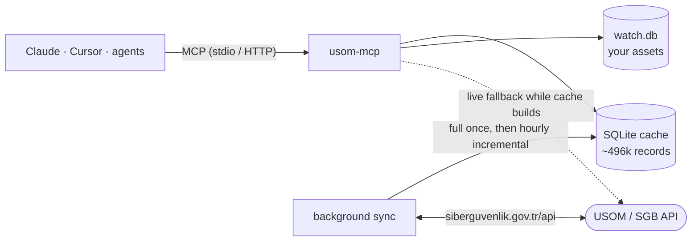

<div align="center">

# 🛡️ usom-mcp

### Türkiye'nin ulusal zararlı bağlantı istihbaratı, AI ajanlarının parmaklarının ucunda.
### Turkey's national malicious-link intelligence, at your AI agent's fingertips.

<br>

[](https://github.com/MustafaKemal0146/usom-mcp/actions/workflows/ci.yml)


**⚡ ~2 ms lookups &nbsp;·&nbsp; 🗄️ 496k records cached locally &nbsp;·&nbsp; 🔭 watch your own domains &nbsp;·&nbsp; 🔌 zero config**

[🇬🇧 English](#-english) &nbsp;|&nbsp; [🇹🇷 Türkçe](#-türkçe)

<sub>Unofficial project. Not affiliated with, endorsed by, or operated by T.C. Cumhurbaşkanlığı Siber Güvenlik Başkanlığı (SGB) / USOM.<br>Resmî değildir; T.C. Siber Güvenlik Başkanlığı / USOM ile bağlantısı yoktur.</sub>

</div>

---

## 🇬🇧 English

### ✨ What is this?

`usom-mcp` is an [MCP](https://modelcontextprotocol.io) server that puts the **USOM / T.C. Siber Güvenlik Başkanlığı** malicious-address list behind a handful of well-designed tools. Ask Claude, Cursor or your own security agent *"is this link safe?"* and get an answer in milliseconds, with the **record date, source, category and match type**, not a guess.

```text
You   ▸ Is https://garanti-kredi-uzmani.cloud/login legit?

Claude▸ ⚠️ No. USOM lists garanti-kredi-uzmani.cloud (exact match)
        · category: Financial Phishing (BP)
        · source: İHBAR (reporting) · criticality 4
        · record date: 2026-10-06 14:26:41 (timezone not specified by USOM)
        Don't enter credentials. Cache is fresh (synced 11 min ago).
```

> The conversation above is illustrative; the record behind it is real data from the live list.

### 🚀 Quick start

Requires Python 3.11+ and [uv](https://docs.astral.sh/uv/).

```bash
uvx usom-mcp            # run the server (stdio)
uvx usom-mcp --sync     # optional: pre-build the local cache, then exit
```

> Until the first PyPI release, run from source:
> `uvx --from git+https://github.com/MustafaKemal0146/usom-mcp usom-mcp`

<details open>
<summary><b>Claude Desktop</b> — <code>claude_desktop_config.json</code></summary>

```json
{
  "mcpServers": {
    "usom": { "command": "uvx", "args": ["usom-mcp"] }
  }
}
```
</details>

<details open>
<summary><b>Claude Code</b></summary>

```bash
claude mcp add usom -- uvx usom-mcp
# with optional enrichment keys:
claude mcp add usom -e VIRUSTOTAL_API_KEY=... -e ABUSEIPDB_API_KEY=... -- uvx usom-mcp
```
</details>

<details open>
<summary><b>Cursor</b> — <code>~/.cursor/mcp.json</code> (or <code>.cursor/mcp.json</code> in a project)</summary>

```json
{
  "mcpServers": {
    "usom": { "command": "uvx", "args": ["usom-mcp"] }
  }
}
```
</details>

<details>
<summary><b>Streamable HTTP</b> (optional)</summary>

```bash
uvx usom-mcp --transport http --host 127.0.0.1 --port 8000   # endpoint: http://127.0.0.1:8000/mcp
claude mcp add --transport http usom http://127.0.0.1:8000/mcp
```

There is **no authentication**. Keep it on `127.0.0.1`; every client of one HTTP server shares the same watch list.
</details>

💡 **Pro tip:** copy [`SKILL.md`](SKILL.md) into your skills directory so Claude knows *when* to call which tool, and to always cite the record date and source.

### 🧰 Tools

| Tool | What it does |
|---|---|
| `check_url(url, enrich=false)` | Is this URL listed? Exact, parent-domain, URL-path and CIDR matching |
| `check_domain(domain, enrich=false)` | Is this domain (or a parent of it) listed? IDN-safe |
| `check_ip(ip, enrich=false)` | Is this IPv4/IPv6 listed, exactly or inside a listed network? |
| `latest_threats(limit, type, category)` | Newest records, newest first |
| `search_threats(query, type, category, source, connection_type, max_criticality_level, date_from, date_to, limit, offset)` | Keyword, type, category and date-range search |
| `stats()` | Record counts, newest record, last sync, cache state |
| `watch_add(values, label)` | Add your own domains / IPs / CIDR networks to a local watch list |
| `watch_remove(values)` | Remove entries |
| `watch_list()` | Show the list |
| `watch_check(value=None)` | Scan **the whole list in one call**. For domains it also finds **listed subdomains below** them and what is **new since last check** |

Every check returns `verdict` (`listed` · `not_listed` · `unknown`) and, for each hit, its **match type** (`exact`, `subdomain`, `www_variant`, `url_exact`, `url_prefix`, `cidr`), **record date**, source, category, connection type and criticality (1 = highest). Every response carries `stale`, `data_origin` (`cache` / `live`), `cache{…}` and `source`. Bad input never crashes a call: you get a structured `error` with a hint.

### 🏗️ How it works



- **Cache-first.** A local SQLite copy answers in about 2 ms. The first start downloads everything in the background (50 requests, **about 4–9 minutes** measured, ~100 MB on disk, because the upstream service is slow). Until it is ready, `check_*` answers from the live API (`data_origin: "live"`).
- **Stays fresh.** Hourly incremental updates (a few seconds), a full re-download every 7 days or whenever the upstream count drifts, which catches deleted records.
- **Survives outages.** If USOM is unreachable you keep getting answers from the last cache, with `stale: true` once it is older than the TTL.
- **Careful matching.** Scheme, port, userinfo, defanged input (`hxxp://evil[.]com`), IDN → punycode and IPv6 canonical form are normalized. A listed parent domain matches its subdomains; the reverse does not (it shows up in `watch_check` instead).
- **Hostile-data aware.** The list is partly crowd-sourced. Values containing whitespace or control characters are rejected before they can reach a language model.
- **Optional enrichment.** Set `VIRUSTOTAL_API_KEY` and/or `ABUSEIPDB_API_KEY`; used only for `check_*` with `enrich=true`, never for watch scans. This sends the indicator to a third party. Without keys nothing is called and no field is added.

### 📊 Measured (real data, 6 Oct 2026)

| | |
|---|---|
| Records cached | **495,817** (domain 473,243 · url 6,927 · ip 15,641 · ip6 6) |
| Full download | 265 s (4–9 min across runs) · 50 requests · ~96 MB |
| Incremental sync | ~5 s |
| `check_domain` / `check_url` / `check_ip` | **~1.4–2.1 ms** |
| `search_threats` (substring over 496k rows) | ~47 ms |
| Cache vs. live API | 40 / 40 random records identical |

### ⚙️ Configuration

| Variable | Default | Meaning |
|---|---|---|
| `USOM_MCP_HOME` | platform data dir | where `cache.db` and `watch.db` live |
| `USOM_MCP_TTL_SECONDS` | `3600` | refresh interval |
| `USOM_MCP_NO_SYNC` | unset | `1` disables network refreshes (offline use) |
| `USOM_MCP_LOG_LEVEL` | `INFO` | logs go to stderr |
| `VIRUSTOTAL_API_KEY`, `ABUSEIPDB_API_KEY` | unset | optional enrichment |
| `USOM_MCP_TRANSPORT`, `_HOST`, `_PORT`, `_PATH` | `stdio`, `127.0.0.1`, `8000`, `/mcp` | CLI defaults |

### 📡 Data source

Data comes from the official API at `https://siberguvenlik.gov.tr/api/` (OpenAPI: `/api/openapi.yaml`, no authentication). The old `usom.gov.tr/url-list.txt` file is gone: `usom.gov.tr` now redirects to `siberguvenlik.gov.tr` and the `.txt` distribution ended on 1 June 2026. Please read the upstream [terms of use](https://siberguvenlik.gov.tr/yasal-uyarilar) before redistributing the data. Every hit is attributed to *T.C. Siber Güvenlik Başkanlığı / USOM*.

### ⚠️ Limitations (read this)

- **"Not listed" is not "safe".** USOM is one national list, not a full reputation database.
- Record timestamps come **without a timezone**; they are passed through unchanged.
- CIDR matching is implemented, but the list currently contains no network entries.

### 🧪 Development

```bash
uv sync
uv run pytest tests/unit -q                           # unit tests (offline)
USOM_LIVE=1 uv run pytest tests/integration -m live   # hits the real API
uv run ruff check src tests && uv run mypy
```

Strictly typed, 200+ offline tests, mutation-checked on the critical paths. MIT licensed.

---

## 🇹🇷 Türkçe

### ✨ Bu nedir?

`usom-mcp`, **USOM / T.C. Siber Güvenlik Başkanlığı** zararlı adres listesini birkaç iyi tasarlanmış araçla sunan bir [MCP](https://modelcontextprotocol.io) sunucusudur. Claude'a, Cursor'a ya da kendi güvenlik ajanına *"bu link güvenli mi?"* diye sor; tahmin değil, **kayıt tarihi, kaynak, kategori ve eşleşme tipi** ile milisaniyeler içinde cevap al.

```text
Sen   ▸ https://garanti-kredi-uzmani.cloud/login güvenilir mi?

Claude▸ ⚠️ Hayır. USOM garanti-kredi-uzmani.cloud'u listeliyor (tam eşleşme)
        · kategori: Bankacılık - Oltalama (BP)
        · kaynak: İHBAR · kritiklik 4
        · kayıt tarihi: 2026-10-06 14:26:41 (USOM saat dilimi belirtmiyor)
        Bilgi girmeyin. Cache güncel (11 dk önce senkronlandı).
```

> Yukarıdaki konuşma örnektir; arkasındaki kayıt canlı listeden gelen gerçek veridir.

### 🚀 Hızlı başlangıç

Python 3.11+ ve [uv](https://docs.astral.sh/uv/) gerekir.

```bash
uvx usom-mcp            # sunucuyu çalıştır (stdio)
uvx usom-mcp --sync     # isteğe bağlı: yerel cache'i önceden oluşturup çık
```

> İlk PyPI sürümüne kadar kaynaktan çalıştırın:
> `uvx --from git+https://github.com/MustafaKemal0146/usom-mcp usom-mcp`

<details open>
<summary><b>Claude Desktop</b> — <code>claude_desktop_config.json</code></summary>

```json
{
  "mcpServers": {
    "usom": { "command": "uvx", "args": ["usom-mcp"] }
  }
}
```
</details>

<details open>
<summary><b>Claude Code</b></summary>

```bash
claude mcp add usom -- uvx usom-mcp
# isteğe bağlı zenginleştirme anahtarlarıyla:
claude mcp add usom -e VIRUSTOTAL_API_KEY=... -e ABUSEIPDB_API_KEY=... -- uvx usom-mcp
```
</details>

<details open>
<summary><b>Cursor</b> — <code>~/.cursor/mcp.json</code> (veya projede <code>.cursor/mcp.json</code>)</summary>

```json
{
  "mcpServers": {
    "usom": { "command": "uvx", "args": ["usom-mcp"] }
  }
}
```
</details>

<details>
<summary><b>Streamable HTTP</b> (isteğe bağlı)</summary>

```bash
uvx usom-mcp --transport http --host 127.0.0.1 --port 8000   # uç nokta: http://127.0.0.1:8000/mcp
claude mcp add --transport http usom http://127.0.0.1:8000/mcp
```

**Kimlik doğrulaması yoktur.** `127.0.0.1`'de tutun; aynı HTTP sunucusuna bağlanan tüm istemciler aynı izleme listesini paylaşır.
</details>

💡 **İpucu:** Claude'un hangi aracı ne zaman çağıracağını ve kayıt tarihi ile kaynağı mutlaka belirtmesini öğrenmesi için [`SKILL.md`](SKILL.md) dosyasını skill dizininize kopyalayın.

### 🧰 Araçlar

| Araç | Ne yapar |
|---|---|
| `check_url(url, enrich=false)` | URL listede mi? Tam, üst alan adı, URL yolu ve CIDR eşleşmesi |
| `check_domain(domain, enrich=false)` | Alan adı (veya üst alan adı) listede mi? IDN uyumlu |
| `check_ip(ip, enrich=false)` | IPv4/IPv6 tam olarak ya da listelenmiş bir ağın içinde mi? |
| `latest_threats(limit, type, category)` | En yeni kayıtlar, yeniden eskiye |
| `search_threats(query, type, category, source, connection_type, max_criticality_level, date_from, date_to, limit, offset)` | Kelime, tür, kategori ve tarih aralığı araması |
| `stats()` | Kayıt sayıları, en yeni kayıt, son senkronizasyon, cache durumu |
| `watch_add(values, label)` | Kendi alan adı / IP / CIDR ağlarını yerel izleme listesine ekle |
| `watch_remove(values)` | Kayıt çıkar |
| `watch_list()` | Listeyi göster |
| `watch_check(value=None)` | **Tüm listeyi tek çağrıda** tara. Alan adları için **altında listelenmiş alt alan adlarını** ve **son kontrolden beri yeni olanları** da bulur |

Her kontrol `verdict` (`listed` · `not_listed` · `unknown`) döner; her eşleşme için **eşleşme tipi** (`exact`, `subdomain`, `www_variant`, `url_exact`, `url_prefix`, `cidr`), **kayıt tarihi**, kaynak, kategori, bağlantı tipi ve kritiklik (1 = en yüksek) bulunur. Her yanıtta `stale`, `data_origin` (`cache` / `live`), `cache{…}` ve `source` vardır. Hatalı girdi çağrıyı çökertmez: ipucu içeren yapılandırılmış bir `error` alırsınız.

### 🏗️ Nasıl çalışır

- **Önce cache.** Yerel SQLite kopyası yaklaşık 2 ms'de cevap verir. İlk açılışta her şey arka planda indirilir (50 istek, ölçülen **yaklaşık 4–9 dakika**, diskte ~100 MB; kaynak servis yavaştır). Hazır olana kadar `check_*` canlı API'den cevap verir (`data_origin: "live"`).
- **Taze kalır.** Saatlik artımlı güncelleme (birkaç saniye); 7 günde bir ya da kaynakla kayıt sayısı ayrışınca tam yeniden indirme, böylece silinen kayıtlar da yakalanır.
- **Kesintiye dayanıklı.** USOM'a erişilemezse son cache ile cevap vermeye devam eder; yaş TTL'yi aşınca `stale: true` işaretlenir.
- **Dikkatli eşleştirme.** Scheme, port, kullanıcı bilgisi, `hxxp://evil[.]com` gibi zararsızlaştırılmış girdiler, IDN → punycode ve IPv6 kanonik biçim normalize edilir. Listelenmiş üst alan adı alt alan adlarını kapsar; tersi geçerli değildir (bu durum `watch_check` içinde ayrıca gösterilir).
- **Düşmanca veriye karşı bilinçli.** Liste kısmen halk ihbarlarından oluşur. Boşluk veya kontrol karakteri içeren değerler, bir dil modeline ulaşmadan reddedilir.
- **İsteğe bağlı zenginleştirme.** `VIRUSTOTAL_API_KEY` ve/veya `ABUSEIPDB_API_KEY` tanımlayın; yalnızca `enrich=true` ile `check_*` araçlarında çalışır, izleme taramalarında asla. Göstergeyi üçüncü tarafa gönderir. Anahtar yoksa hiçbir çağrı yapılmaz ve alan eklenmez.

### 📊 Ölçülen değerler (gerçek veri, 6 Ekim 2026)

| | |
|---|---|
| Cache'teki kayıt | **495.817** (domain 473.243 · url 6.927 · ip 15.641 · ip6 6) |
| Tam indirme | 265 sn (koşulara göre 4–9 dk) · 50 istek · ~96 MB |
| Artımlı senkronizasyon | ~5 sn |
| `check_domain` / `check_url` / `check_ip` | **~1,4–2,1 ms** |
| `search_threats` (496 bin satırda alt dize) | ~47 ms |
| Cache ↔ canlı API | 40 / 40 rastgele kayıt birebir aynı |

### ⚙️ Yapılandırma (ortam değişkenleri)

| Değişken | Varsayılan | Anlamı |
|---|---|---|
| `USOM_MCP_HOME` | platform veri dizini | `cache.db` ve `watch.db` konumu |
| `USOM_MCP_TTL_SECONDS` | `3600` | yenileme aralığı |
| `USOM_MCP_NO_SYNC` | tanımsız | `1` ağ yenilemelerini kapatır (çevrimdışı kullanım) |
| `USOM_MCP_LOG_LEVEL` | `INFO` | loglar stderr'e gider |
| `VIRUSTOTAL_API_KEY`, `ABUSEIPDB_API_KEY` | tanımsız | isteğe bağlı zenginleştirme |
| `USOM_MCP_TRANSPORT`, `_HOST`, `_PORT`, `_PATH` | `stdio`, `127.0.0.1`, `8000`, `/mcp` | CLI varsayılanları |

### 📡 Veri kaynağı

Veri, resmî API'den gelir: `https://siberguvenlik.gov.tr/api/` (OpenAPI: `/api/openapi.yaml`, kimlik doğrulama yok). Eski `usom.gov.tr/url-list.txt` dosyası artık yok: `usom.gov.tr` adresi `siberguvenlik.gov.tr`'ye yönleniyor ve `.txt` paylaşımı 1 Haziran 2026'da sona erdi. Veriyi yeniden dağıtmadan önce kaynağın [kullanım şartlarını](https://siberguvenlik.gov.tr/yasal-uyarilar) okuyun. Tüm sonuçlarda kaynak *T.C. Siber Güvenlik Başkanlığı / USOM* olarak belirtilir.

### ⚠️ Sınırlamalar (lütfen okuyun)

- **"Listede yok" ≠ "güvenli".** USOM tek bir ulusal listedir, tam bir itibar veritabanı değildir.
- Kayıt zaman damgaları **saat dilimi olmadan** gelir; olduğu gibi aktarılır.
- CIDR eşleştirmesi uygulanmıştır, ancak listede şu an ağ kaydı yoktur.

### 🧪 Geliştirme

```bash
uv sync
uv run pytest tests/unit -q                           # birim testler (çevrimdışı)
USOM_LIVE=1 uv run pytest tests/integration -m live   # gerçek API'ye gider
uv run ruff check src tests && uv run mypy
```

Katı tip denetimli, 200'den fazla çevrimdışı test, kritik yollarda mutasyon testiyle sınanmış. MIT lisanslı.

---

<div align="center">

**Built for defenders.** 🛡️ &nbsp; If this saved you a phishing click, consider leaving a ⭐

</div>
